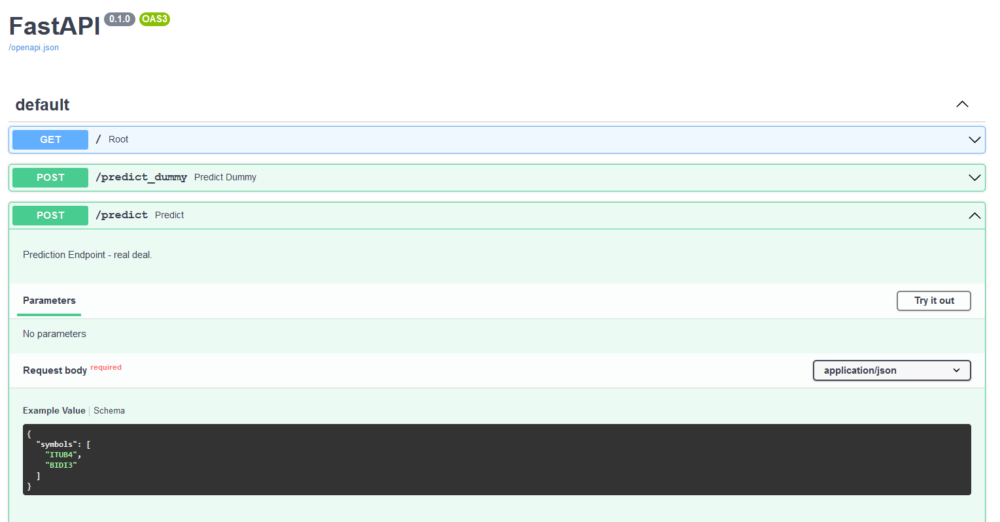

# Stock Scrapper API

An automated Stock Scrapper, made possible with python + selenium + FastAPI.

It is just like searching for your stocks on Google, but automated.

Under the hood, we have a python application navigating on Google, searching for your stocks.

# Usage

## Starting the application

Get the application through one of:

- docker container

      $ docker run -p 8000:8000 erickfis/stock-scrapper

- tox (install tox first)

      $ cd code/stock_scrapper
      $ tox -e run

- python (install requirements first)

      $ cd code/stock_scrapper/src
      $ uvicorn main:app --reload

## Using the API

After starting the application, just navigate to http://127.0.0.1:8000/docs/ and follow the instructions for the predict Endpoint.

# Docker image

The production docker image can be pulled from

https://hub.docker.com/repository/docker/erickfis/stock-scrapper

# About

- Erick Medeiros Anastacio
- Data Scientist
- erickfis@gmail.com
- [portfolio](https://erickfis.github.io/portfolio/)
- [linkedin](https://www.linkedin.com/in/erick-medeiros-anast%C3%A1cio-15241717/)
